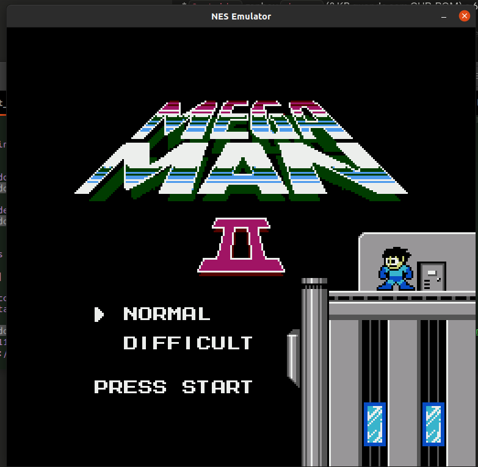
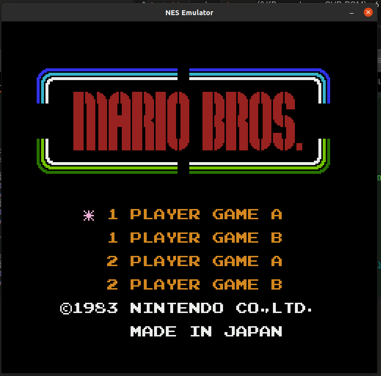
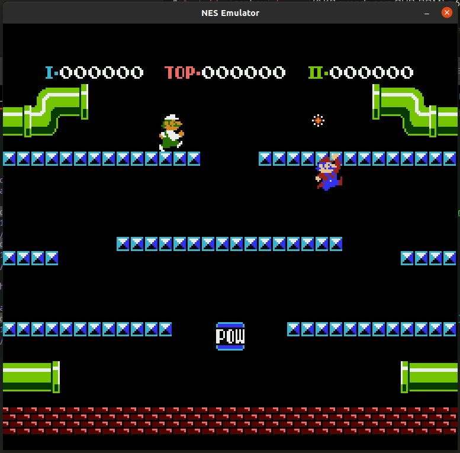

# 🎮 NES Emulator

<div align="center">

A Nintendo Entertainment System emulator written in **Rust** (core) + **Python** (frontend), bridged via PyO3.

[](https://www.rust-lang.org/)
[](https://www.python.org/)
[](LICENSE)
[](https://github.com)
[](roms/)
[](https://pyo3.rs/)

</div>

---

## 📸 Screenshots

<div align="center">

| Mega Man II — título (Mapper 1) | Mario Bros — título (Mapper 0) |
|:---:|:---:|
|  |  |

| Mario Bros — gameplay |
|:---:|
|  |

</div>

---

## ✨ Features

| Componente | Status | Detalhes |
|---|---|---|
| **CPU MOS 6502** | ✅ Completa | Todos os 56 opcodes oficiais + ilegais (LAX, SAX, DCP, ISC, RLA, SLO, SRE, RRA). Validada com **nestest 8991/8991** |
| **PPU** | ✅ Completa | Background com scroll completo, sprites, OAM DMA, Sprite 0 Hit, VBlank/NMI |
| **APU** | ✅ Implementada | Pulse 1 & 2, Triangle, Noise — frame counter 4/5-step, mixing linear |
| **Input** | ✅ Implementado | Protocolo serial NES, mapeamento completo de teclado |
| **Mapper 0** | ✅ | NROM (16 KB espelhado e 32 KB) |
| **Mapper 1** | ✅ | MMC1 — PRG/CHR bank switching 4 modos, CHR-RAM, mirroring dinâmico |
| **Mapper 2** | ✅ | UxROM — PRG bank switching 16 KB (lo selecionável, hi fixo no último banco), CHR fixo ou CHR-RAM |
| **Frontend** | ✅ | Pygame, escala 3×, 60.098 fps (NTSC exato via `tick_busy_loop`), áudio 44100 Hz estéreo com backpressure |
| **Bridge** | ✅ | PyO3 + maturin — módulo `.so` importável pelo Python |

---

## 🕹️ Jogos Compatíveis

Testados e funcionando:

| Jogo | Mapper |
|---|---|
| Super Mario Bros | Mapper 0 |
| Donkey Kong | Mapper 0 |
| Pac-Man | Mapper 0 |
| Mario Bros | Mapper 0 |
| Mega Man 2 | Mapper 1 (MMC1) |
| The Legend of Zelda | Mapper 1 (MMC1) |
| Metroid | Mapper 1 (MMC1) |
| Mega Man | Mapper 2 (UxROM) |
| Contra | Mapper 2 (UxROM) |
| Castlevania | Mapper 2 (UxROM) |
| DuckTales | Mapper 2 (UxROM) |

> ROMs proprietárias não estão incluídas no repositório. Use apenas ROMs que você possui legalmente.

---

## 📋 Requisitos

- **Rust** 1.70+ com `cargo`
- **Python** 3.8+
- **maturin** (`pip install maturin`)
- **pygame** (`pip install pygame`)
- **numpy** (`pip install numpy`)

---

## 🚀 Instalação e Uso

```bash
# 1. Clone o repositório
git clone https://github.com/GustavoGarciaPereira/emulador_nes_com_rust.git
cd emulador_nes_com_rust

# 2. Crie e ative o ambiente virtual Python
python -m venv venv
source venv/bin/activate          # Linux/macOS
# venv\Scripts\activate           # Windows

# 3. Instale as dependências Python
pip install maturin pygame numpy

# 4. Compile o core Rust em modo release e instale no venv
maturin develop --release

# 5. Execute com uma ROM
python main.py roms/jogo.nes

# (opcional) exibe FPS, core µs, render µs e estado do áudio no terminal
python main.py roms/jogo.nes --diag
```

---

## ⌨️ Controles

| Tecla | Botão NES |
|---|---|
| `Z` | A |
| `X` | B |
| `Enter` | Start |
| `R Shift` | Select |
| `↑ ↓ ← →` | D-Pad |
| `Esc` | Sair |

---

## 🏗️ Arquitetura

O emulador usa uma arquitetura híbrida: o core de hardware roda em Rust para máxima performance, e o frontend em Python para facilidade de desenvolvimento.

```
┌─────────────────────────────────────────────────────────────┐
│                        main.py (Python)                      │
│                                                              │
│   Pygame Window   ──►  Keyboard Input  ──►  Audio Output    │
│        │                    │                    ▲           │
│        │ get_framebuffer()  │ set_input()        │           │
│        │                    │        get_audio_samples()     │
└────────┼────────────────────┼────────────────────┼──────────┘
         │                    │                    │
         │        PyO3 + maturin (.so bridge)      │
         │                    │                    │
┌────────▼────────────────────▼────────────────────┼──────────┐
│                      nes_core (Rust)              │          │
│                                                   │          │
│  ┌──────────┐   ┌──────────┐   ┌──────────┐  ┌──┴─────┐   │
│  │  CPU     │   │  PPU     │   │  APU     │  │  Bus   │   │
│  │ MOS 6502 │◄──│ 256×240  │   │ 4 canais │  │ memory │   │
│  │ + ilegais│   │ bg+sprite│   │ 44100 Hz │  │  map   │   │
│  └────┬─────┘   └────┬─────┘   └──────────┘  └──┬─────┘   │
│       │              │                            │          │
│       └──────────────┴────────────────────────────┘          │
│                             │                                 │
│                    ┌────────▼────────┐                       │
│                    │   Cartridge     │                       │
│                    │  Mapper 0 NROM  │                       │
│                    │  Mapper 1 MMC1  │                       │
│                    │  Mapper 2 UxROM │                       │
│                    └─────────────────┘                       │
└─────────────────────────────────────────────────────────────┘
```

### Componentes Rust (`src/`)

| Arquivo | Responsabilidade |
|---|---|
| `lib.rs` | Bridge PyO3 — expõe `struct Nes` ao Python |
| `cpu.rs` | CPU MOS 6502 completa |
| `bus.rs` | Barramento de memória, mapa de endereços |
| `ppu.rs` | PPU — rendering, VBlank, NMI |
| `apu.rs` | APU — síntese de áudio |
| `cartridge.rs` | Parser iNES, Mapper 0, Mapper 1/MMC1, Mapper 2/UxROM |

---

## 🗺️ Roadmap

- [x] **Mapper 2** (UxROM) — Mega Man, Castlevania, Contra, DuckTales
- [ ] **Mapper 4** (MMC3) — Super Mario Bros 3, Mega Man 3–6
- [ ] **APU DMC** — canal de sample delta (PCM)
- [ ] **Save States** — salvar e carregar estado completo
- [ ] **Segundo controle** — suporte ao controlador 2
- [ ] **Sprites 8×16** — modo de sprites altos do PPU
- [ ] **Correção de timing** — ciclos exatos por instrução

---

## 📚 Referências

- [NESDev Wiki](https://www.nesdev.org/wiki/) — referência primária para todo o hardware NES
- [6502 opcodes oficiais](https://www.nesdev.org/obelisk-6502-guide/reference.html)
- [6502 opcodes ilegais](https://www.nesdev.org/wiki/CPU_unofficial_opcodes)
- [Formato iNES](https://www.nesdev.org/wiki/INES)
- [PPU rendering](https://www.nesdev.org/wiki/PPU_rendering)
- [nestest ROM](http://www.qmtpro.com/~nes/misc/nestest.txt) — suite de testes da CPU
- [PyO3](https://pyo3.rs/) — bindings Rust/Python
- [maturin](https://www.maturin.rs/) — build tool para extensões Python em Rust

---

## 📄 Licença

Este projeto está licenciado sob a [MIT License](LICENSE).

---

<div align="center">
Feito com ♥ em Rust + Python
</div>
